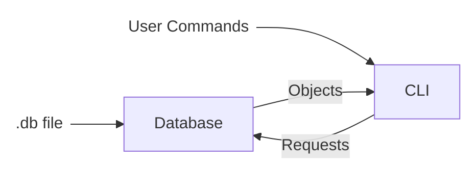
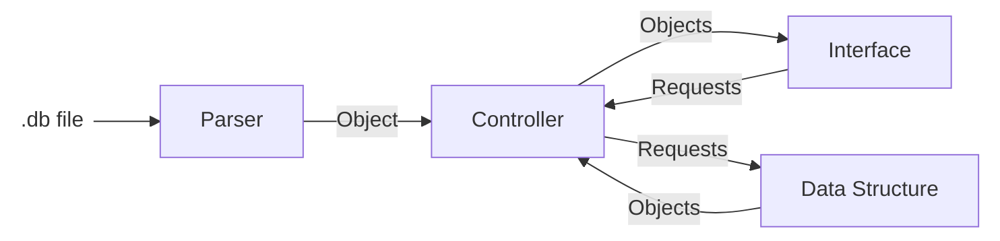

# Steps to complete the project:

## Requirements:

* Reads and Writes to .db files
* Reads line by line the file
  * Each line is an individual element
  * Correct format is \<command\> \<key\> \<value (optional)/>
  * Loads each element into memory using different data structures:
    * Uses an configurable value that switches between data structure at runtime
    * When switching data structure, old information needs to be cleaned and reloaded into memory
    * A Hash Table
    * A Linked List
  * Changes must be reflected in disk (atomic write)
    * Deleting and writing all the file (slower(?))
    * Updating the file (faster(?))
* Use unit testing framework
* Make a CLI Tool to manage a database
* Selecting the database to use
* Create a Static Library
* Automate Tests and the Static Library creation with github actions (???)

## Steps
* ✓ Configure CMake
* Make a program that can read and write to .db files
  * ✓ Delimiters as constants
  * ✓ Read:
    * ✓ Read line by line
    * ✓ Parse each line into command key and value
    * ✓ Create and object from the parsed information
    * ✓ Load the object into the selected data structure
  * ✓ Write:
    * ✓ Create a format string from an entry object
    * ✓ Implement atomic write
* ✓ Create the configurable data structure
* ✓ Load the database into the structure
* ✓ Add CLI Loop
  * ✓ Ability to load more than one database into memory
  * ✓ Switch between the loaded DBs
  * ✓ put, get, delete from db
* Static Library
* Add Tests framework

## Architecture

### Database

### CLI Design

#### Main Menu
* \> _waiting for command_: 
  1. ✓ Load a Database from a File
    * ✓ load \<db_path\> \<db_id\> \<storage_type\>
    * ✓ Must check that the id is not repeated
  2. ✓ Use a loaded database:
     * ✓ use <db_id>
     * ✓ Enters another loop that runs commands in the database
  3. ✓ List loaded databases:
     * ✓ list
  4. ✓ Help
  5. ✓ Exit
      * ✓ exit

#### Use Console
* \> _waiting for command_:
  1. ✓ Allow to apply operations in a DB
    * ✓ put \<key\> \<value\> \<type\>
      * ✓ Inserts an entry
      * ✓ Updates the entry if it already exists
    * ✓ get \<key\>
      * ✓ gets a value from the database by key
    * ✓ delete \<key\>
      * ✓ deletes an entry from the database
    * ✓ Every operation to the db must be instantly applied to the file
  2. ✓ Help
  3. ✓ Exit
    * ✓ Exits to the main menu 

### Known Issues
* There is no way of entering spaces when saving a string
* 