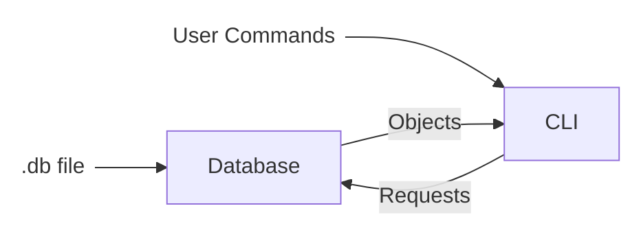
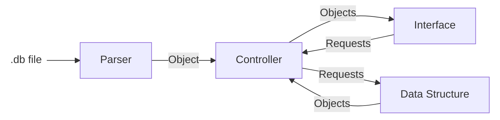

# Steps to complete the project:

## Requirements:
1. ✓ Reads and Writes to .db files (Parser)
  * ✓ Correct format is \<type\>:\<key\>=\<value\> 
  * ✓ Delimiters as constants
  * ✓ Read:
    * ✓ Parse line by line
    * ✓ Create and object from the parsed information
    * ✓ Load the object into the selected data structure
  * ✓ Write:
    * ✓ Create a format string from an entry object
    * ✓ Implement atomic write

2. Make a CLI Tool to manage a database (CLI Tool)
  * ✓ Correct format is \<command\> \<param_1\> \<param_2\> \<param_3\>

  * ✓ Loads multiple files into memory using different data structures:
    * ✓ load \<db_path\> \<db_id\> \<storage_type\>
      * ✓ Checks uniqueness of db_path
      * ✓ Checks uniqueness of db_id
    * ✓ A Hash Table
    * ✓ A Linked List

  * ✓ Reloads a database using another data structure
      ✓ reload \<db_id\> \<storage_type\>
  
  * ✓ List all loaded databases and their path

  * ✓ Select a database by its id to operate on it
     * ✓ use <db_id>
       * ✓ Enters another loop that operates on the database

  * ✓ Show help - Commands and how to use

3. Operate on database (CLI Tool)
    * ✓ put \<key\> \<value\> \<type\>
      * ✓ Inserts an entry
      * ✓ Updates the entry if it already exists
    * ✓ get \<key\>
      * ✓ gets a value from the database by key
    * ✓ delete \<key\>
      * ✓ deletes an entry from the database
    * ✓ Every operation to the db must be instantly applied to the file
   * ✓ Show help - Commands and how to use

4. ✓ CMake
  * ✓ Create a Static Library for database controller (use in other code)
  * ✓ Create an executable for the cli (uses the database controller)
* Use unit testing framework
* Automate Tests and the Static Library creation with github actions (???)

### Known Issues
* There is no way of entering spaces when saving a string

## Architecture

### Database

