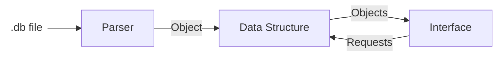

# Steps to complete the project:

## Requirements:

* Reads and Writes to .db files
* Reads line by line the file
  * Each line is an individual element
  * Correct format is \<command\> \<key\> \<value (optional)/>
  * Loads each element into memory using different data structures:
    * Uses an configurable value that switches between data structure at runtime
    * When switching data structure, old information needs to be cleaned and reloaded into memory
    * A Hash Table
    * A Linked List
  * Changes must be reflected in disk (atomic write)
    * Deleting and writing all the file (slower(?))
    * Updating the file (faster(?))
* Use unit testing framework
* Make a CLI Tool to manage a database
* Selecting the database to use
* Create a Static Library
* Automate Tests and the Static Library creation with github actions (???)

## Steps
* Configure CMake
* Make a program that can read and write to .db files
* Read line by line
* Parse each line into command key and value
* Create and object from the parsed information
* Load the object into the selected data structure
* Create the configurable data structure
* Decide how to perform updates
* Implement atomic write
* Add CLI Loop
* Static Library

## Architecture

### Database

